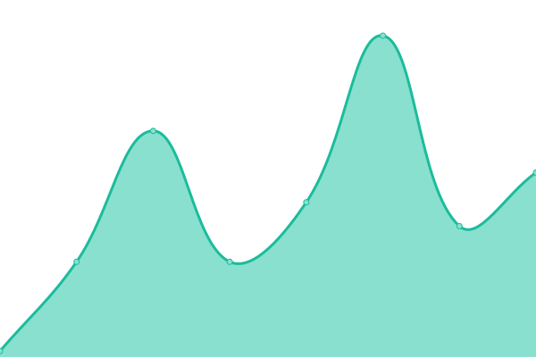
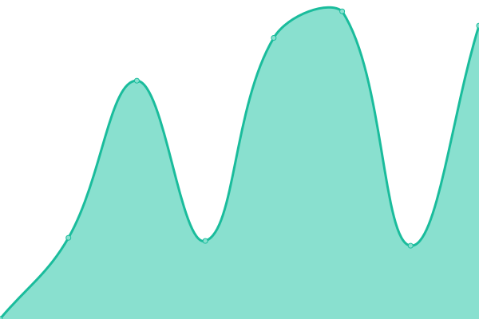

# [📈 Live Status](https://stats.brainbox.tools): <!--live status--> **🟩 All systems operational**

This repository contains the open-source uptime monitor and status page for [Roman Parodi](https://stats.brainbox.tools), powered by [Upptime](https://github.com/upptime/upptime).

With [Upptime](https://upptime.js.org), you can get your own unlimited and free uptime monitor and status page, powered entirely by a GitHub repository. We use [Issues](https://github.com/brparodi/stats/issues) as incident reports, [Actions](https://github.com/brparodi/stats/actions) as uptime monitors, and [Pages](https://stats.brainbox.tools) for the status page.

<!--start: status pages-->
<!-- This summary is generated by Upptime (https://github.com/upptime/upptime) -->
<!-- Do not edit this manually, your changes will be overwritten -->
<!-- prettier-ignore -->
| URL | Status | History | Response Time | Uptime |
| --- | ------ | ------- | ------------- | ------ |
|  [BrainHost Website](https://brainhost.ch/) | 🟩 Up | [brain-host-website.yml](https://github.com/brparodi/stats/commits/HEAD/history/brain-host-website.yml) | 

 246ms
     
 | 

<a href="https://stats.brainbox.tools/history/brain-host-website">99.65%</a>
    

|  [BrainHost Portal](https://portal.brainhost.ch/) | 🟩 Up | [brain-host-portal.yml](https://github.com/brparodi/stats/commits/HEAD/history/brain-host-portal.yml) | 

 829ms
     
 | 

<a href="https://stats.brainbox.tools/history/brain-host-portal">88.22%</a>
    

|  [DNS (CH)](ch.brainhost.ch) | 🟩 Up | [dns-ch.yml](https://github.com/brparodi/stats/commits/HEAD/history/dns-ch.yml) | 

 127ms
     
 | 

<a href="https://stats.brainbox.tools/history/dns-ch">100.00%</a>
    

|  [DNS (ASIA)](asia.brainhost.ch) | 🟩 Up | [dns-asia.yml](https://github.com/brparodi/stats/commits/HEAD/history/dns-asia.yml) | 

 195ms
     
 | 

<a href="https://stats.brainbox.tools/history/dns-asia">100.00%</a>
    

|  [DNS (US)](us.brainhost.ch) | 🟩 Up | [dns-us.yml](https://github.com/brparodi/stats/commits/HEAD/history/dns-us.yml) | 

 34ms
     
 | 

<a href="https://stats.brainbox.tools/history/dns-us">100.00%</a>
    

|  [WebRain](https://webrain.ch/) | 🟩 Up | [web-rain.yml](https://github.com/brparodi/stats/commits/HEAD/history/web-rain.yml) | 

 962ms
     
 | 

<a href="https://stats.brainbox.tools/history/web-rain">100.00%</a>
    

<!--end: status pages-->

[**Visit our status website →**](https://stats.brainbox.tools)

## 📄 License

- Powered by: [Upptime](https://github.com/upptime/upptime)
- Code: [MIT](./LICENSE) © [Roman Parodi](https://stats.brainbox.tools)
- Data in the `./history` directory: [Open Database License](https://opendatacommons.org/licenses/odbl/1-0/)
